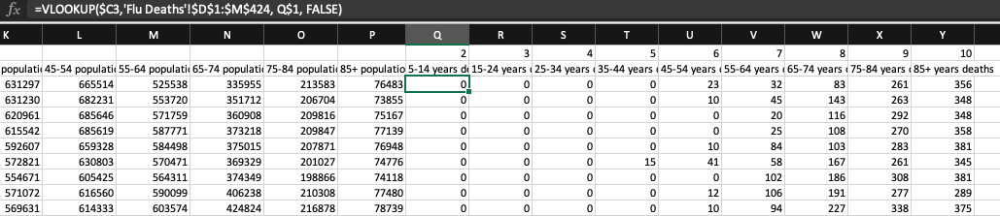
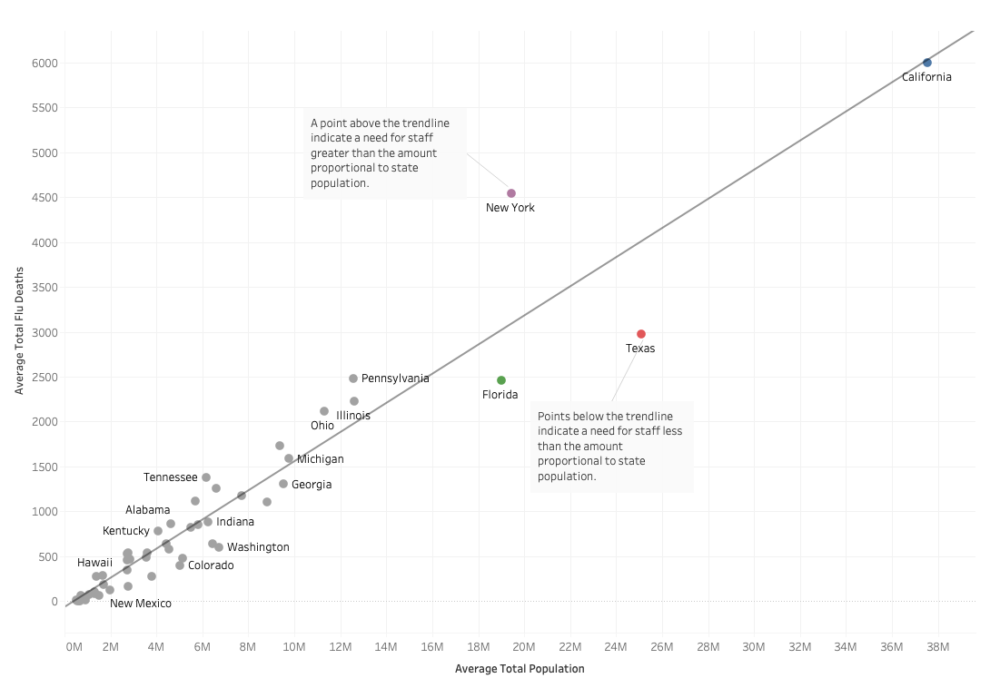

# [Projects](https://nlogandata.wordpress.com/projects/)

# Influenza Tableau Project Case Study
The following project is an assignment from CareerFoundry's Data Analytics course. I completed the project independently. The data are historical data from the US census Bureau and the CDC. See the full GitHub repository [here](https://github.com/nlogan-data/Influenza-Tableau-Project).

## Overview and Purpose
A medical staffing agency needed help planning the distribution of temporary workers to United States clinics and hospitals for flu season. They need an analyst's help examining historical data to inform planning. 

## Context
The staffing agency covers healthcare providers in all 50 states, and they are planning for the upcoming flu season. They share that a state's historical flu death count gives an indication of the severity of flu in the area and that vulnerable populations suffer the most severe impacts from the flu, leaving them more likely for hospitalization.

Find the data I used, sourced from the US Census Bureau and the CDC, [here](https://github.com/nlogan-data/Influenza-Tableau-Project/tree/main/Data). 

Stakeholders include medical frontline staff, healthcare providers using the staffing agency, influenza patients, and staffing agency administrators.

## Objective
•	Provide information to support a staffing plan, detailing what data can help inform the timing and spatial distribution of medical personnel throughout the United States.

•	Prioritize states with large vulnerable populations. Consider categorizing each state as low-, medium-, or high-need based on its vulnerable population count.

•	Assess data limitations that may prevent you from conducting your desired analyses.

## Tools and Skills
 
**Excel:** Analysis

•	Data Integrity Checks

•	Data Quality Measures

•	Data Transformation and Integration

**Tableau:** Visualizations and Storyboard

•	Composition and Comparison Charts

•	Temporal Visualizations and Forecasting

•	Statistical Visualizations

•	Spatial Analysis

•	Textual Analysis

## Project Steps
First, I layed out a design for the project. See it [here](Docs/ProjectDesign.pdf). I included in it my project management plan, questions to guide my analysis, and an initial hypothesis.

Then, I familiarized myself with the datasets and created the [data summary](Docs/DataSummary.pdf). I decided to focus on the Census data and flu death data to determine the relationship between vulnerable populations and flu severity. Because age was the only vulnerability present in the datasets, I made age a focal point of my analysis.

Once I had a grasp of the data I was working with, I assessed the integrity of the data. Frequency tables and basic statistics informed this process, as I ensured that the data were accurate, consistent, and without corruption. Knowing this, the door was open for more data quality measures.

In addition to the data's integrity, I also evaluated the data's completeness, uniqueness, and timeliness. I decided what to do with missing values, determined the data grain, removed duplicates, and described the rate at which the data was collected. These steps were crucial to the accuracy of the analysis.

With clean datasets, I could integrate the two. First, I had to find common variables to map the datasets. This required data transformations for both sources. My goal was to integrate the datasets on the observations' year and state. However, the flu deaths were reported monthly for each state, and the census was collected annually for each county. I made the necessary aggregations to adjust the data: I found the sum of flu deaths by year and the population sum by state. Next, I reduced two common variables to one by concatenation. Additionally, the population age bins were smaller than the flu death age bins. So combined categories in the population data to match (e.g.: I summed 5 to 9 and 10 to 14 to make 5 to 14. Finally, I executed a VLOOKUP to integrate the data. I had to perform the data integration to analyze the relationship between the population data and flu deaths. See the final dataset [here](Data/Census-FluDeaths-final.xlsx)

Once I had a uniform set of data to analyze, I began the visual analysis in Tableau. I made several visualizations before creating a final storyboard. This included composition charts, comparison charts, temporal visualizations with forecasting, histograms, box and whisker plots, scatterplots, bubble charts, and spatial analysis.

Then I chose the visualizations—each displaying data by state—that offered the most insight to create a storyboard: my scatterplots of deaths vs population, separate temporal charts showing population and flu deaths over time, and my choropleth and graduated symbol combination map.

See full the storyboard [here](https://public.tableau.com/app/profile/nick.logan5306/viz/Storyboard_16433158656590/Story1?publish=yes).

## Conclusion

I was able share insights from historical data with the staffing agency, making suggestions for their planning of the upcoming flu season. 

The most challenging aspect of the project was transforming the data sets to prepare them for integration. It took great care to make sure the data sets were compatible with one another. Some of the steps were tedious, while others required clever methods to grow closer to uniformity. I had fun working through this stage of the process, and I was happy with the result.

To improve upon this analysis, I would have included the vaccination dataset in my analysis. The assignment task asked that we choose two of the four datasets. Vaccination is significant variable in the fight against influenza, so it would be necessary to include in a more robust analysis.
